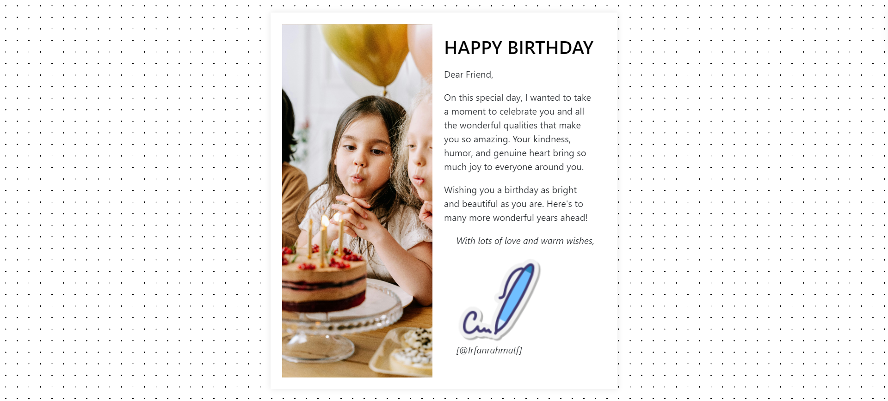

# Simple Birthday Web

This project is a simple birthday webpage created as an assignment for Hacktiv8. It features a celebratory design with interactive elements to wish someone a happy birthday.

## File Structure

```
birthday-web/
│
├── index.html
├── style.css
├── script.js
└── images/
    └── images.png
```

## Features

- Responsive design
- Interactive birthday message
- Animated elements
- Customizable content

## Preview




## Getting Started

1. Clone this repository or download the files.
2. Open `index.html` in your web browser to view the birthday web.
3. Customize the content in `index.html` to personalize the birthday message.
4. Modify `style.css` to change the appearance of the web page.
5. Edit `script.js` to add or modify interactive features.


## Technologies Used

- HTML5
- Framework CSS (Bootstrap 5)
- JavaScript

## Live Demo

live demo of this project:  
[Live Demo](https://irfanrahmatf.github.io/Assignment-2-Simple-Birthday-Page/)

## Author

[@Irfanrahmatf]
